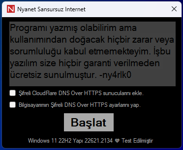

# Nyanet
<br><a href="https://github.com/ny4rlk0/Nyanet/releases/download/GelistiriciSurumu/GelistiriciSurumu.zip">Nyanet İndir Yeni Sürüm / Download Nyanet New Version</a>
<br><a href="https://www.virustotal.com/gui/file/8e910b396e1a56a08bf8fd0050c4d42b2e3e3f6f5150b5b208aeda55fa70dd70/detection">Virustotal</a>
<br>
<br>x64 makinede denenmiştir x86'da çalışmayabilir.
<br>Microsoft Edge yeni eklenen güvenlik ağı adlı vpn servisi yazılımın çalışmasını bozuyor. Edge kullanırken Gizlilik Arama ve Hizmetlerden kapatın.
<br>Türkiye'den, dünyadaki tüm sitelere sansürsüz girmenizi sağlayan yazılım.
<br>C# ve C++ ile yazılmıştır.
<br>DNS işinizi kendiniz halledemiyorsanız ilk çalıştırmanızda Gereksinimleri İndir 'i işaretleyin bittikten sonra DNS ayaarlarını uygulaya baasın en sonda Başlat'a basmanızı tavsiye ederim.
<br>~ny4rlk0
<br>Yenilikler: Yazılım kurcalanmaya karşı güvenceye alındı. Eksik dosyaları bu repodan yeniden indirme özelliği eklendi. Kendini koruma özelliği eklendi. Hata ayıklamaya karşı basit önlemler alındı. DoH eklerken ayarların çalışmamasına ve şifreli DNS hizmetinin açılmamasına sebep olan bir hata düzeltildi! (Bu hatayı düzeltmek için regedit ayarlamaları yapmak gerekti.) Bir terslik olmazsa daha fazla güncelleme almayacak.
<br>Yazılım beklentilerimde istediğim fonksiyonalite ve amaca ulaştı. Bir şeyler yolunda gitmediği sürece daha fazla güncelleme almayacaktır!
<br><a href="https://github.com/ny4rlk0/Nyanet/releases/download/GelistiriciSurumu/GelistiriciSurumu.zip">Nyanet İndir Yeni Sürüm / Download Nyanet New Version</a>
<br>
<br>
## Gereksinimler (Bunlar yüklü olmadan bilgisayarınızda çalışmaz!)
<br>windowsdesktop-runtime-6.0.20-win-x64
<br>windowsdesktop-runtime-6.0.20-win-x86
<br><a href="https://github.com/ny4rlk0/Nyanet/releases/tag/Gereksinimler">Gereksinimleri indirmek için tıkla!</a>
<br><br>
<br>
<br><a href="https://github.com/ny4rlk0/Nyanet/files/12543047/Nyanet.zip">Nyanet Eski Sürüm</a>
<br>DNS Sunucusu Ekle (+ butonu) kısmındaki alanların hepsinin dolu olması gerekmektedir. İlk açıldığında ne yazmanız gerektiğine dair örnek görünüyor zaten.
<br>Ekle'ye bastıktan sonra listeden eklediğiniz sunucunun adını seçin ve sırasıyla DNS ekle ve DNS aktifleştiri işaretleyin. 
<br>Artık sisteminize DNS eklemiş ve aktifleştirmiş bulunuyorsunuz. İsterseniz hazır Google ve Cloudflare DNS sunucularını da kullanabilirsiniz.
<br>Yine herhangi bir DNS sunucusunu seçtikten sonra sırasıyla DNS ekle ve DNS aktifleştiri işaretleyin.
<br>Yazılım içinde farklı modlar var ancak varsayılan yazanlarla sabit kalmanızı tavsiye ederim.
<br>İlk kullanımınızda DNS altındaki tüm tik işareti olanları bir kere işaretleyin. En alttaki Gereksinim olan Windows Desktop Runtime'ın belirli sürümlerini
<br>indirmesi internetinize bağlı biraz uzun sürebilir. Yaklaşık 104.4MB indirme yapacaktır ve otomatik yükleyecektir. Yükleme bitince ekranda gözükecektir.
<br>
<br>Bilinen Buglar: (+) butonu ile dns ekledikten sonra eklenen DNS sunucusu dışında başka bir sunucu seçip uygularsanız eklediğiniz sunucu listede görünmesine rağmen programı
<br>yeniden başlatana kadar o ayarları kullanamıyorsunuz. Kodlama kısmında Ekle kısmından aldığım değişkenleri yedek değişkenlerde tutmamam bu hataya sebep oldu.
<br>Bu hata programın akışını etkilemiyor. Şimdilik düzeltmeyle uğraşmayacağım. .d (Yeni sürümde bu sorun çözüldü!)
<br>
<br>Neler Yapıyor Merak Ediyorsanız Detayına İnelim Biraz:
<br>Program Açılıyor ve Eksik dosyam var mı? diye kontrol ediyor. (Bir kere)
<br>Herhangi bir hata ayıklama uygulaması var mı? diye kontrol ediyor varsa Nyanet'i bilgisayarınızdan siliyor. Çalışıyorsa kurcalamayın işte asdalkşdjawld.
<br>Yoksa içerdiği tüm dosyaların MD5 değerlerini kontrol ediyor. Bir dosya değiştirilmişse tüm programı githubdan yeniden indiriyor. (30 saniyede bir defa)
<br>Programın çalıştığı klasörde kendi dosyalarından başka bir dosya ya da klasör varmı diye kontrol ediyor. Varsa kurcalanmayı önlemek için kendisini NyanetSoftwareProtectionService adlı klasör oluşturup ona kopyalıyor ve not bırakıyor.
<br>Programı githubdan yeniden indirirken bu sayfadaki linkteki sürümü software.zip olarak indirip aynı klasörde Release adlı bir kasöre çıkartıyor.
<br>Yazılım indirme sırasında oluşan: nyaInternalCodes.bat=> Program kendisini yeniden indirdiğinde mevcut programı sonlandırıp siliyor. Güvenliği bilinen sürümünü olan indirilmiş programı açıyor. Zip dosyası ve release klasörünü silip kendinide siliyor.(Bana göre güvenliği bilinen. Kaynak kodu açık olmadığı için. lol)
<br>Başlat tuşu: Bu programa özel C++'da yazılmış DPI Sansürünü Aşan bir servisi seçili modda başlatıyor.
<br>Seçili DNS ayarlarını uygula: Yukarıda seçtiğiniz DNS ayarlarını regedit üzerinden bilgisayarınıza uyguluyor. (DNS Over Https'yi aktif değilse regedite müdehale edip group policy ayarlarını değiştirerek aktive ediyor.)
<br>Yenile: Regediti ağ adaptörleri için sorguluyor.
<br>0.03 Saniyede bir eğer başka işlem yapmıyorsa DNS sunucularını kontrol ediyor, eğer değişmişse ekrana yazıyor.
<br>Buradaki bilgilere bakarak Virustotalde hangi uyarının neden geldiğini anlayabilirsiniz.
<br>
<br>Bazen programı silmeye çalışırken windivert.sys dosyası takılı kalıyor.
<br>Komut satırını yönetici olarak çalıştırın.
<br>```sc query windivert```
<br>```sc stop windivert```
<br>Not: Programın arkaplanındaki çizimde bana ait.
<br> Hangi regedit keylerinde işlem yapıyorum? Hangi regedit keylerinde neyin tutulduğunu bulmak biraz uğraştırıcıydı...
<br> Bunun için programın kaynak kodundan küçük bir parçaya bakalım.
```
\"HKLM\\SOFTWARE\\Microsoft\\Windows NT\\CurrentVersion\\NetworkCards
\"HKLM\\SOFTWARE\\Policies\\Microsoft\\Windows NT\\DNSClient\" /F"
\"HKLM\\SOFTWARE\\Policies\\Microsoft\\Windows NT\\DNSClient\" /v DoHPolicy /t REG_DWORD /d 2 /F
\"HKLM\\SYSTEM\\CurrentControlSet\\Services\\Dnscache\\Parameters\\DohWellKnownServers\" /F
\"HKLM\\SYSTEM\\CurrentControlSet\\Services\\Dnscache\\Parameters\\DohWellKnownServers\\" + dnsv4_1 + "\" /F
\"HKLM\\SYSTEM\\CurrentControlSet\\Services\\Dnscache\\Parameters\\DohWellKnownServers\\" + dnsv4_1 + "\" /v Template /t REG_SZ /d " + httpsTemplate + " /F
\"HKLM\\SYSTEM\\CurrentControlSet\\Services\\Dnscache\\Parameters\\DohWellKnownServers\\" + dnsv4_2 + "\" /F
\"HKLM\\SYSTEM\\CurrentControlSet\\Services\\Dnscache\\Parameters\\DohWellKnownServers\\" + dnsv4_2 + "\" /v Template /t REG_SZ /d " + httpsTemplate + " /F
\"HKLM\\SYSTEM\\CurrentControlSet\\Services\\Dnscache\\Parameters\\DohWellKnownServers\\" + dnsv6_1 + "\" /F
\"HKLM\\SYSTEM\\CurrentControlSet\\Services\\Dnscache\\Parameters\\DohWellKnownServers\\" + dnsv6_1 + "\" /v Template /t REG_SZ /d " + httpsTemplate + " /F
\"HKLM\\SYSTEM\\CurrentControlSet\\Services\\Dnscache\\Parameters\\DohWellKnownServers\\" + dnsv6_2 + "\" /F
\"HKLM\\SYSTEM\\CurrentControlSet\\Services\\Dnscache\\Parameters\\DohWellKnownServers\\" + dnsv6_2 + "\" /v Template /t REG_SZ /d " + httpsTemplate + " /F
gpupdate /force
netsh interface ipv4 set dns name=\"Ethernet\" source=static address=none
netsh interface ipv4 set dns name=\"Wi-Fi\" source=static address=none
netsh interface ipv6 set dns name=\"Ethernet\" source=static address=none
netsh interface ipv6 set dns name=\"Wi-Fi\" source=static address=none
netsh interface ipv4 add dnsservers \"Wi-Fi\" " +dnsv4_1+" index=1
netsh interface ipv4 add dnsservers \"Wi-Fi\" " +dnsv4_2+" index=2
netsh interface ipv6 add dnsservers \"Wi-Fi\" " +dnsv6_1+" index=1
netsh interface ipv6 add dnsservers \"Wi-Fi\" " +dnsv6_2+" index=2
netsh interface ipv4 add dnsservers \"Ethernet\" " +dnsv4_1+" index=1
netsh interface ipv4 add dnsservers \"Ethernet\" " +dnsv4_2+" index=2
netsh interface ipv6 add dnsservers \"Ethernet\" " +dnsv6_1+" index=1
netsh interface ipv6 add dnsservers \"Ethernet\" " +dnsv6_2+" index=2
\"HKLM\\SYSTEM\\CurrentControlSet\\Services\\Dnscache\\InterfaceSpecificParameters\\" + networkAdapterGUID + "\" /F
\"HKLM\\SYSTEM\\CurrentControlSet\\Services\\Dnscache\\InterfaceSpecificParameters\\" + networkAdapterGUID + "\\DohInterfaceSettings\" /F
\"HKLM\\SYSTEM\\CurrentControlSet\\Services\\Dnscache\\InterfaceSpecificParameters\\" + networkAdapterGUID + "\\DohInterfaceSettings\\Doh\" /F
\"HKLM\\SYSTEM\\CurrentControlSet\\Services\\Dnscache\\InterfaceSpecificParameters\\" + networkAdapterGUID + "\\DohInterfaceSettings\\Doh6\" /F
\"HKLM\\SYSTEM\\CurrentControlSet\\Services\\Dnscache\\InterfaceSpecificParameters\\" + networkAdapterGUID + "\\DohInterfaceSettings\\Doh\\" + dnsv4_1 + "\" /F
\"HKLM\\SYSTEM\\CurrentControlSet\\Services\\Dnscache\\InterfaceSpecificParameters\\" + networkAdapterGUID + "\\DohInterfaceSettings\\Doh\\" + dnsv4_2 + "\" /F
\"HKLM\\SYSTEM\\CurrentControlSet\\Services\\Dnscache\\InterfaceSpecificParameters\\" + networkAdapterGUID + "\\DohInterfaceSettings\\Doh6\\" + dnsv6_1 + "\" /F
\"HKLM\\SYSTEM\\CurrentControlSet\\Services\\Dnscache\\InterfaceSpecificParameters\\" + networkAdapterGUID + "\\DohInterfaceSettings\\Doh6\\" + dnsv6_1 + "\" /F
\"HKLM\\SYSTEM\\CurrentControlSet\\Services\\Dnscache\\InterfaceSpecificParameters\\" + networkAdapterGUID + "\\DohInterfaceSettings\\Doh\\" + dnsv4_1 + "\" /v DohTemplate /t REG_SZ /d " + httpsTemplate + " /F
\"HKLM\\SYSTEM\\CurrentControlSet\\Services\\Dnscache\\InterfaceSpecificParameters\\" + networkAdapterGUID + "\\DohInterfaceSettings\\Doh\\" + dnsv4_2 + "\" /v DohTemplate /t REG_SZ /d " + httpsTemplate + " /F
\"HKLM\\SYSTEM\\CurrentControlSet\\Services\\Dnscache\\InterfaceSpecificParameters\\" + networkAdapterGUID + "\\DohInterfaceSettings\\Doh6\\" + dnsv6_1 + "\" /v DohTemplate /t REG_SZ /d " + httpsTemplate + " /F
\"HKLM\\SYSTEM\\CurrentControlSet\\Services\\Dnscache\\InterfaceSpecificParameters\\" + networkAdapterGUID + "\\DohInterfaceSettings\\Doh6\\" + dnsv6_2 + "\" /v DohTemplate /t REG_SZ /d " + httpsTemplate + " /F
\"HKLM\\SYSTEM\\CurrentControlSet\\Services\\Dnscache\\InterfaceSpecificParameters\\" + networkAdapterGUID + "\\DohInterfaceSettings\\Doh\\" + dnsv4_1 + "\" /v DohFlags /t REG_QWORD /d \"0x1\" /F//0x0 Disabled 0x1 Enabled Windows Settings Uygulamasındaki şifreli DNS sunucusu ayarını aktifleştiriyor
\"HKLM\\SYSTEM\\CurrentControlSet\\Services\\Dnscache\\InterfaceSpecificParameters\\" + networkAdapterGUID + "\\DohInterfaceSettings\\Doh\\" + dnsv4_2 + "\" /v DohFlags /t REG_QWORD /d \"0x1\" /F//0x0 Disabled 0x1 Enabled
\"HKLM\\SYSTEM\\CurrentControlSet\\Services\\Dnscache\\InterfaceSpecificParameters\\" + networkAdapterGUID + "\\DohInterfaceSettings\\Doh6\\" + dnsv6_1 + "\" /v DohFlags /t REG_QWORD /d \"0x1\" /F//0x0 Disabled 0x1 Enabled
\"HKLM\\SYSTEM\\CurrentControlSet\\Services\\Dnscache\\InterfaceSpecificParameters\\" + networkAdapterGUID + "\\DohInterfaceSettings\\Doh6\\" + dnsv6_2 + "\" /v DohFlags /t REG_QWORD /d \"0x1\" /F//0x0 Disabled 0x1 Enabled 
```
#English Section (Google Translate Sucks)
----------------------------------------------------------------------------------------------------------------------------------------------------------------------
<br><a href="https://github.com/ny4rlk0/Nyanet/releases/download/GelistiriciSurumu/GelistiriciSurumu.zip">Download Nyanet New Version / Download Nyanet New Version</a>
<br><a href="https://www.virustotal.com/gui/file/8e910b396e1a56a08bf8fd0050c4d42b2e3e3f6f5150b5b208aeda55fa70dd70/detection">Virustotal</a>
<br>
<br>Tested on x64 machine, may not work on x86.
<br>Microsoft Edge's VPN service software called the "new open security network" disrupts this programs operation . When using Edge, turn off Privacy from Search and Services.
<br>This software provides uncensored access to entire internet.
<br>Written in C# and C++.
<br>If you can't set the DNS over HTTPS properly, I recommend that you check Download Requirements, then apply the DNS settings and press Start at the end when you first run it.
<br>~ny4rlk0
<br>What's New: The software is secured against simple tampering. Added the ability to re-download missing files from this repo. Added self protection feature. Simple precautions were taken against debugging. Fixed a bug that caused the settings to work and the encrypted DNS service to be turned on when adding DoH! (It was necessary to make regedit adjustments to correct this error.) If nothing goes wrong, no further updates will be made.
<br>The software reached the functionality and purpose I expected. It won't get any more updates unless something goes wery wrongly!
<br><a href="https://github.com/ny4rlk0/Nyanet/releases/download/GelistiriciSurumu/GelistiriciSurumu.zip">Download Nyanet New Version</a>
<br>
## Requirements (These will not work without them installed! You can also auto install them from programs UI.)
<br>windowsdesktop-runtime-6.0.20-win-x64
<br>windowsdesktop-runtime-6.0.20-win-x86
<br><a href="https://github.com/ny4rlk0/Nyanet/releases/tag/Requirements">Click to download the requirements!</a>
<br><br>
<br>
<br><a href="https://github.com/ny4rlk0/Nyanet/files/12543047/Nyanet.zip">Nyanet Old Version</a>
<br>The host system in the Adding DNS Server (+ button) section must be full. When you first open it, an example of what you need to write already appears.
<br>After pressing Add, select the name of the server you added from the list and press Apply DNS Settings.
<br>You have now added and activated DNS oover HTTPS to your system. You can also use Google and Cloudflare DNS servers whose settings are prebuilt into program.
<br>After changing any DNS server,press Aplly DNS Settings.
<br>There are different modes within the software, but I recommend you stick with the default ones.
<br>On your first use, tick check mark under Set DNS Settings once. At the bottom, select the specific versions of Windows Desktop Runtime that are required.
<br>It will download approximately 104.4MB and will be installed automatically. It will appear on the screen when the installation is finished.
<br>
<br>Known Bugs: It is displayed after adding DNS with the (+) button. If you select another server other than the DNS server, the program will not be displayed even though the server you added is in the list.
<br>You don't use those settings until you reboot. This error was caused by not keeping the variables of the inserted parts in the coding section in backup variables.
<br>This error does not affect the operation of the program. I won't bother improving it for now. .d (This problem has been solved in the new version!)
<br>
<br>If you are wondering what he does, let's go into detail:
<br>The program opens and Is there any missing file? he checks. (One time)
<br>Are there any debugging applications? If it checks, Nyanet is deleted from your computer. If it's working, don't tamper with it, it's asdalkşdjawld.
<br>Otherwise, it checks the MD5 values of all files. If a file is deleted, the entire program is re-downloaded from github. (one time for 30 seconds)
<br>It checks whether there is a file or folder other than its own files in the folder of the program's size. To prevent tampering, if any, it creates a folder named NyanetSoftwareProtectionService, copies itself onto it and does not release it.
<br>While the program is being re-downloaded from github, the version in the link on this page is downloaded as software.zip and extracted to a folder named Version in the same folder.
<br>Occurs during software download: nyaInternalCodes.bat=> When the program downloads itself again, the current program is terminated and deleted. The downloaded program, whose security will be protected, is applied. It deletes the zip file and version folder and then deletes itself. (Security is known to me. The source code was not open. lol)
<br>Start button: A service that exceeds the DPI Censor written in C++ specific to this program is started in the selected mode.
<br>Apply selected DNS fragments: height DNS fragments are edited via regedit. (DNS Over Https is not activated, regedit intervenes and enables group policy changes.)
<br>Refresh: Querying Regedit for network adapters.
<br>0.03 Every second, if it is not doing anything else, it checks the DNS servers, and if they have changed, it writes to the screen.
<br>By looking at the information here, you can understand which warning appears in Virustotal and why.
<br>
<br>Sometimes the windivert.sys file gets stuck when trying to delete the program.
<br>Run the command line as administrator.
<br>```sc query windivert```
<br>```sc stop windivert```
<br> Which regedit keys I'am reading/writing.
<br> Let's look some small part of the programs source code.
```
\"HKLM\\SOFTWARE\\Microsoft\\Windows NT\\CurrentVersion\\NetworkCards
\"HKLM\\SOFTWARE\\Policies\\Microsoft\\Windows NT\\DNSClient\" /F"
\"HKLM\\SOFTWARE\\Policies\\Microsoft\\Windows NT\\DNSClient\" /v DoHPolicy /t REG_DWORD /d 2 /F
\"HKLM\\SYSTEM\\CurrentControlSet\\Services\\Dnscache\\Parameters\\DohWellKnownServers\" /F
\"HKLM\\SYSTEM\\CurrentControlSet\\Services\\Dnscache\\Parameters\\DohWellKnownServers\\" + dnsv4_1 + "\" /F
\"HKLM\\SYSTEM\\CurrentControlSet\\Services\\Dnscache\\Parameters\\DohWellKnownServers\\" + dnsv4_1 + "\" /v Template /t REG_SZ /d " + httpsTemplate + " /F
\"HKLM\\SYSTEM\\CurrentControlSet\\Services\\Dnscache\\Parameters\\DohWellKnownServers\\" + dnsv4_2 + "\" /F
\"HKLM\\SYSTEM\\CurrentControlSet\\Services\\Dnscache\\Parameters\\DohWellKnownServers\\" + dnsv4_2 + "\" /v Template /t REG_SZ /d " + httpsTemplate + " /F
\"HKLM\\SYSTEM\\CurrentControlSet\\Services\\Dnscache\\Parameters\\DohWellKnownServers\\" + dnsv6_1 + "\" /F
\"HKLM\\SYSTEM\\CurrentControlSet\\Services\\Dnscache\\Parameters\\DohWellKnownServers\\" + dnsv6_1 + "\" /v Template /t REG_SZ /d " + httpsTemplate + " /F
\"HKLM\\SYSTEM\\CurrentControlSet\\Services\\Dnscache\\Parameters\\DohWellKnownServers\\" + dnsv6_2 + "\" /F
\"HKLM\\SYSTEM\\CurrentControlSet\\Services\\Dnscache\\Parameters\\DohWellKnownServers\\" + dnsv6_2 + "\" /v Template /t REG_SZ /d " + httpsTemplate + " /F
gpupdate /force
netsh interface ipv4 set dns name=\"Ethernet\" source=static address=none
netsh interface ipv4 set dns name=\"Wi-Fi\" source=static address=none
netsh interface ipv6 set dns name=\"Ethernet\" source=static address=none
netsh interface ipv6 set dns name=\"Wi-Fi\" source=static address=none
netsh interface ipv4 add dnsservers \"Wi-Fi\" " +dnsv4_1+" index=1
netsh interface ipv4 add dnsservers \"Wi-Fi\" " +dnsv4_2+" index=2
netsh interface ipv6 add dnsservers \"Wi-Fi\" " +dnsv6_1+" index=1
netsh interface ipv6 add dnsservers \"Wi-Fi\" " +dnsv6_2+" index=2
netsh interface ipv4 add dnsservers \"Ethernet\" " +dnsv4_1+" index=1
netsh interface ipv4 add dnsservers \"Ethernet\" " +dnsv4_2+" index=2
netsh interface ipv6 add dnsservers \"Ethernet\" " +dnsv6_1+" index=1
netsh interface ipv6 add dnsservers \"Ethernet\" " +dnsv6_2+" index=2
\"HKLM\\SYSTEM\\CurrentControlSet\\Services\\Dnscache\\InterfaceSpecificParameters\\" + networkAdapterGUID + "\" /F
\"HKLM\\SYSTEM\\CurrentControlSet\\Services\\Dnscache\\InterfaceSpecificParameters\\" + networkAdapterGUID + "\\DohInterfaceSettings\" /F
\"HKLM\\SYSTEM\\CurrentControlSet\\Services\\Dnscache\\InterfaceSpecificParameters\\" + networkAdapterGUID + "\\DohInterfaceSettings\\Doh\" /F
\"HKLM\\SYSTEM\\CurrentControlSet\\Services\\Dnscache\\InterfaceSpecificParameters\\" + networkAdapterGUID + "\\DohInterfaceSettings\\Doh6\" /F
\"HKLM\\SYSTEM\\CurrentControlSet\\Services\\Dnscache\\InterfaceSpecificParameters\\" + networkAdapterGUID + "\\DohInterfaceSettings\\Doh\\" + dnsv4_1 + "\" /F
\"HKLM\\SYSTEM\\CurrentControlSet\\Services\\Dnscache\\InterfaceSpecificParameters\\" + networkAdapterGUID + "\\DohInterfaceSettings\\Doh\\" + dnsv4_2 + "\" /F
\"HKLM\\SYSTEM\\CurrentControlSet\\Services\\Dnscache\\InterfaceSpecificParameters\\" + networkAdapterGUID + "\\DohInterfaceSettings\\Doh6\\" + dnsv6_1 + "\" /F
\"HKLM\\SYSTEM\\CurrentControlSet\\Services\\Dnscache\\InterfaceSpecificParameters\\" + networkAdapterGUID + "\\DohInterfaceSettings\\Doh6\\" + dnsv6_1 + "\" /F
\"HKLM\\SYSTEM\\CurrentControlSet\\Services\\Dnscache\\InterfaceSpecificParameters\\" + networkAdapterGUID + "\\DohInterfaceSettings\\Doh\\" + dnsv4_1 + "\" /v DohTemplate /t REG_SZ /d " + httpsTemplate + " /F
\"HKLM\\SYSTEM\\CurrentControlSet\\Services\\Dnscache\\InterfaceSpecificParameters\\" + networkAdapterGUID + "\\DohInterfaceSettings\\Doh\\" + dnsv4_2 + "\" /v DohTemplate /t REG_SZ /d " + httpsTemplate + " /F
\"HKLM\\SYSTEM\\CurrentControlSet\\Services\\Dnscache\\InterfaceSpecificParameters\\" + networkAdapterGUID + "\\DohInterfaceSettings\\Doh6\\" + dnsv6_1 + "\" /v DohTemplate /t REG_SZ /d " + httpsTemplate + " /F
\"HKLM\\SYSTEM\\CurrentControlSet\\Services\\Dnscache\\InterfaceSpecificParameters\\" + networkAdapterGUID + "\\DohInterfaceSettings\\Doh6\\" + dnsv6_2 + "\" /v DohTemplate /t REG_SZ /d " + httpsTemplate + " /F
\"HKLM\\SYSTEM\\CurrentControlSet\\Services\\Dnscache\\InterfaceSpecificParameters\\" + networkAdapterGUID + "\\DohInterfaceSettings\\Doh\\" + dnsv4_1 + "\" /v DohFlags /t REG_QWORD /d \"0x1\" /F//0x0 Disabled 0x1 Enabled Windows Settings Uygulamasındaki şifreli DNS sunucusu ayarını aktifleştiriyor
\"HKLM\\SYSTEM\\CurrentControlSet\\Services\\Dnscache\\InterfaceSpecificParameters\\" + networkAdapterGUID + "\\DohInterfaceSettings\\Doh\\" + dnsv4_2 + "\" /v DohFlags /t REG_QWORD /d \"0x1\" /F//0x0 Disabled 0x1 Enabled
\"HKLM\\SYSTEM\\CurrentControlSet\\Services\\Dnscache\\InterfaceSpecificParameters\\" + networkAdapterGUID + "\\DohInterfaceSettings\\Doh6\\" + dnsv6_1 + "\" /v DohFlags /t REG_QWORD /d \"0x1\" /F//0x0 Disabled 0x1 Enabled
\"HKLM\\SYSTEM\\CurrentControlSet\\Services\\Dnscache\\InterfaceSpecificParameters\\" + networkAdapterGUID + "\\DohInterfaceSettings\\Doh6\\" + dnsv6_2 + "\" /v DohFlags /t REG_QWORD /d \"0x1\" /F//0x0 Disabled 0x1 Enabled 
```
