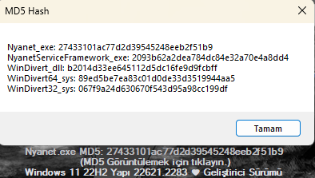

# Nyanet
 Microsoft Edge yeni eklenen güvenlik ağı adlı vpn servisi yazılımın çalışmasını bozuyor. Edge kullanırken Gizlilik Arama ve Hizmetlerden kapatın.
 Türkiye'den, dünyadaki tüm sitelere sansürsüz girmenizi sağlayan yazılım.
 C# ve C++ ile yazılmıştır.
 DNS işinizi kendiniz halledemiyorsanız ilk çalıştırmanızda iki kutucuğuda işaretlemenizi ve Başlat'a basmanızı tavsiye ederim.
 ~ny4rlk0
 <a href="https://github.com/ny4rlk0/Nyanet/releases/download/GelistiriciSurumu/GelistiriciSurumu.zip">Nyanet İndir Yeni Sürüm</a>
  
## Gereksinimler (Bunlar yüklü olmadan bilgisayarınızda çalışmaz!)
 windowsdesktop-runtime-6.0.20-win-x64
 windowsdesktop-runtime-6.0.20-win-x86
 <a href="https://github.com/ny4rlk0/Nyanet/releases/tag/Gereksinimler">Gereksinimleri indirmek için tıkla!</a>
  
 
 <a href="https://github.com/ny4rlk0/Nyanet/files/12543047/Nyanet.zip">Nyanet Eski Sürüm</a>
 DNS Sunucusu Ekle (+ butonu) kısmındaki alanların hepsinin dolu olması gerekmektedir. İlk açıldığında ne yazmanız gerektiğine dair örnek görünüyor zaten.
 Ekle'ye bastıktan sonra listeden eklediğiniz sunucunun adını seçin ve sırasıyla DNS ekle ve DNS aktifleştiri işaretleyin. 
 Artık sisteminize DNS eklemiş ve aktifleştirmiş bulunuyorsunuz. İsterseniz hazır Google ve Cloudflare DNS sunucularını da kullanabilirsiniz.
 Yine herhangi bir DNS sunucusunu seçtikten sonra sırasıyla DNS ekle ve DNS aktifleştiri işaretleyin.
 Yazılım içinde farklı modlar var ancak varsayılan yazanlarla sabit kalmanızı tavsiye ederim.
 İlk kullanımınızda DNS altındaki tüm tik işareti olanları bir kere işaretleyin. En alttaki Gereksinim olan Windows Desktop Runtime'ın belirli sürümlerini
 indirmesi internetinize bağlı biraz uzun sürebilir. Yaklaşık 104.4MB indirme yapacaktır ve otomatik yükleyecektir. Yükleme bitince ekranda gözükecektir.
 
 Bilinen Buglar: (+) butonu ile dns ekledikten sonra eklenen DNS sunucusu dışında başka bir sunucu seçip uygularsanız eklediğiniz sunucu listede görünmesine rağmen programı
 yeniden başlatana kadar o ayarları kullanamıyorsunuz. Kodlama kısmında Ekle kısmından aldığım değişkenleri yedek değişkenlerde tutmamam bu hataya sebep oldu.
 Bu hata programın akışını etkilemiyor. Şimdilik düzeltmeyle uğraşmayacağım. .d
 
 Yazılım bilinçli olarak Türkçe dışında başka bir dile çevrilmedi. Şimdilik sadece Türkçe bilenler ya da Google Translate kullanabilenler kullansın. Fikrimi değiştirirsem ingilizceyede çeviririm.
 İstesem Türkiye dışında bir lokasyonda kullanılmasını çok zor hale getirecek önlemlerde alabilirdim ama uğraşmak istemedim.
