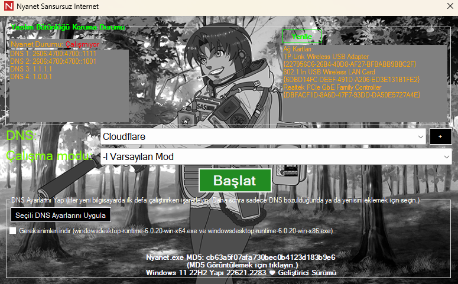
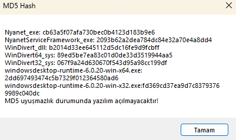

 
# Nyanet
  Güncellendi / Updated! 12.10.2024
 <b><a href="https://github.com/ny4rlk0/Nyanet/releases/download/GelistiriciSurumu/GelistiriciSurumu.zip">Nyanet İndir Yeni Sürüm / Download Nyanet New Version</a></b>
 <a href="https://www.virustotal.com/gui/file/8e910b396e1a56a08bf8fd0050c4d42b2e3e3f6f5150b5b208aeda55fa70dd70/detection">Virustotal</a>
 <b><a href="https://github.com/ny4rlk0/NyanetSourceCode">Source Code / Kaynak Kodu</a></b>

    
    

<!------>
 
  Teşekkürler / Thankyou  ValdikSS, basil00
 
 
 
 
 
 
 
 
 
 
 
 
 
 
 
 
 
 
 
 
 
 
 
 
Eğer çalışmıyorsa: [Cloudflare W.A.R.P.](https://developers.cloudflare.com/cloudflare-one/connections/connect-devices/warp/download-warp/) derin paket inceleme yazılımını hız kesintisi ve limit olmadan başarılı bir şekilde atlatıyor. [En azından Türkiye için.] Bu program yerine alternatif olarak onu kullanabilirsiniz.😉✌️
 
 
Currently [Cloudflare W.A.R.P.](https://developers.cloudflare.com/cloudflare-one/connections/connect-devices/warp/download-warp/) bypasses Deep Packet Inspection entirely. [At the least for Turkey] So you can use that instead of this program.
  
[⏬İndir Download Cloudflare W.A.R.P. Windows 🪟](https://developers.cloudflare.com/cloudflare-one/connections/connect-devices/warp/download-warp/)
 
[⏬İndir Download Cloudflare W.A.R.P. Android 🤖](https://play.google.com/store/apps/details?id=com.cloudflare.onedotonedotonedotone&hl=en_US&pli=1)
 
[⏬İndir Download Cloudflare W.A.R.P. IOS 🍎](https://apps.apple.com/us/app/1-1-1-1-faster-internet/id1423538627)
 
